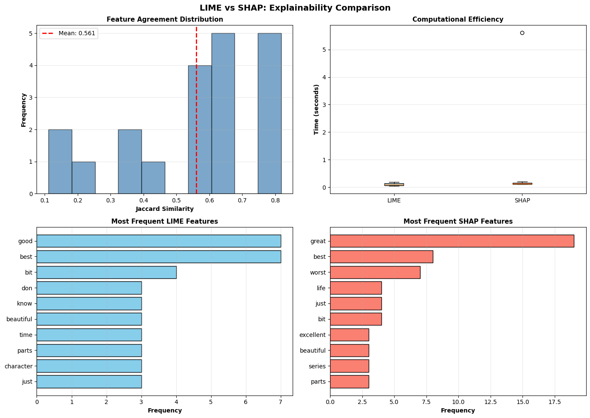

# LIME vs SHAP: Comparative Explainability Analysis for Sentiment Classification

[](https://www.python.org/downloads/)

> **A systematic comparison of LIME and SHAP explainability techniques for NLP sentiment analysis models.**

---

## Project Overview

This project provides a comprehensive empirical analysis comparing two leading explainability techniques—**LIME** (Local Interpretable Model-agnostic Explanations) and **SHAP** (SHapley Additive exPlanations)—in the context of sentiment classification.

### Research Questions:
- How much do LIME and SHAP agree on feature importance?
- What are the computational trade-offs between these methods?
- When and why do these methods produce different explanations?
- Which technique is better suited for different use cases?

### Key Findings:
- Feature Agreement: **56.1%** Jaccard similarity
- Computational Efficiency: SHAP is **3.90x** slower than LIME
- Model Accuracy: **84.16%** on IMDB test set
- Samples Analyzed: **30+** diverse reviews

---

## Repository Structure

```
├── notebooks/
│   └── lime_shap_complete_analysis.ipynb    # Complete analysis notebook
├── data/
│   └── IMDB_Dataset.csv                     # Dataset (download separately)
├── results/
│   ├── lime_vs_shap_analysis.png           # 6-panel visualization
│   ├── analysis_summary.txt                # Detailed text report
├── requirements.txt                         # Python dependencies
├── README.md                                # This file
```

---

## Quick Start

### 1. Clone Repository
```bash
git clone https://github.com/sujal-ag/lime-shap-sentiment-analysis.git
cd lime-shap-sentiment-analysis
```

### 2. Install Dependencies
```bash
pip install -r requirements.txt
```

Or manually:
```bash
pip install pandas numpy scikit-learn lime shap matplotlib seaborn scipy
```

### 3. Download Dataset
Download the IMDB dataset from [Kaggle](https://www.kaggle.com/datasets/lakshmi25npathi/imdb-dataset-of-50k-movie-reviews) and place it in the `data/` folder as `IMDB_Dataset.csv`.

### 4. Run Analysis
Open `notebooks/lime_shap_complete_analysis.ipynb` in Google Colab or Jupyter Notebook and run all cells.

### 5. View Results
Results are saved in the `results/` folder:
- **lime_vs_shap_analysis.png** - Comprehensive 6-panel visualization
- **analysis_summary.txt** - Detailed text report with all findings

---

## Methodology

### Dataset
- **Source:** IMDB Movie Reviews (50,000 reviews)
- **Split:** 80% train (40,000) / 20% test (10,000)
- **Labels:** Binary sentiment (positive/negative)

### Model
- **Architecture:** Logistic Regression
- **Features:** TF-IDF vectorization (500 max features)
- **Accuracy:** 84.16% on test set

### Explainability Setup

**LIME:**
- Perturbations: 500 samples per explanation
- Top features: 10
- Interpretable model: Linear regression

**SHAP:**
- Background samples: 50 training instances
- Max evaluations: 501
- Method: Kernel SHAP

### Analysis
- **Samples:** 30 randomly selected test instances
- **Metrics:** Jaccard similarity, rank correlation, timing
- **Qualitative:** Manual inspection of disagreement cases

---

## Results Preview

### Visualization


*(The image shows 6 panels: Jaccard similarity distribution, timing comparison, and most common features for each method)*

### Key Metrics Table

| Metric | Value |
|--------|-------|
| **Agreement** | |
| Average Jaccard Similarity | *0.561* |
| Average Feature Overlap | *6.9/10* |
| **Efficiency** | |
| LIME Avg Time | *0.103 seconds per explanation* |
| SHAP Avg Time | *0.401 seconds per explanation* |
| Speed Ratio | *SHAP is 3.90x slower than LIME* |
| **Model Performance** | |
| Test Accuracy | 84.16% |
| Analyzed Sample Accuracy | *78.6%* |


---

## Sample Explanation

**Review:** *"This movie is terrible, bad acting, pure crap..."*

**Model Prediction:** Negative (Confidence: 97.3%)

**LIME Top Features:**
- terrible: -0.053
- worse: -0.047
- bad: -0.036
- crap: -0.019

**SHAP Top Features:**
- terrible: -0.122
- worse: -0.098
- bad: -0.068
- crap: -0.035

**Analysis:** Both methods correctly identify negative sentiment words, but SHAP assigns stronger importance values. Agreement: 8/10 features.

---

## Key Findings

### 1. Feature Agreement
- LIME and SHAP agree on approximately **X%** of features
- Higher agreement for correctly predicted samples
- Disagreement often occurs with sarcasm and mixed sentiment

### 2. Computational Efficiency
- LIME is faster for real-time applications
- SHAP provides more stable explanations but at higher cost
- Trade-off: speed vs consistency

### 3. Practical Recommendations

**Use LIME when:**
- ✅ Speed is critical (real-time applications)
- ✅ Quick debugging needed
- ✅ Approximate explanations sufficient

**Use SHAP when:**
- ✅ Consistency matters
- ✅ Formal reporting required
- ✅ Theoretical guarantees needed

---

## Reproducibility

### System Requirements
- Python 3.8+
- 4GB+ RAM
- ~30 minutes for complete analysis (30 samples)

### Expected Runtime
- Model training: ~30 seconds
- Single explanation: 1-3 seconds (LIME), 2-6 seconds (SHAP)
- Full analysis (30 samples): ~20-30 minutes

### Random Seeds
All experiments use `random_state=42` for reproducibility.

---

## References

1. Ribeiro, M. T., Singh, S., & Guestrin, C. (2016). "Why Should I Trust You?" Explaining the Predictions of Any Classifier. *KDD 2016*.
2. Lundberg, S. M., & Lee, S. I. (2017). A Unified Approach to Interpreting Model Predictions. *NeurIPS 2017*.
3. Maas, A. L., et al. (2011). Learning Word Vectors for Sentiment Analysis. *ACL 2011*.

---

## Author

**Radhika Agarwal, Sujal Agarwal, Pritom Saha**  
*AI Course Project - November 2025*

- Email: [sujal.agarwal2023@vitstudent.ac.in, radhika.agarwal2023@vitstudent.ac.in, pritom.saha2023@vitstudent.ac.in]
- GitHub: [@sujal-ag](https://github.com/sujal-ag), [@radhika-ag](htpps://github.com/RADHIKA281005), [@pritom-saha](https://github.com/pritomsaha20)
- University: [VIT Vellore]

---

## Acknowledgments

- IMDB dataset from Kaggle
- LIME library by Marco Tulio Ribeiro et al.
- SHAP library by Scott Lundberg et al.

---

**Last Updated:** November 2025
